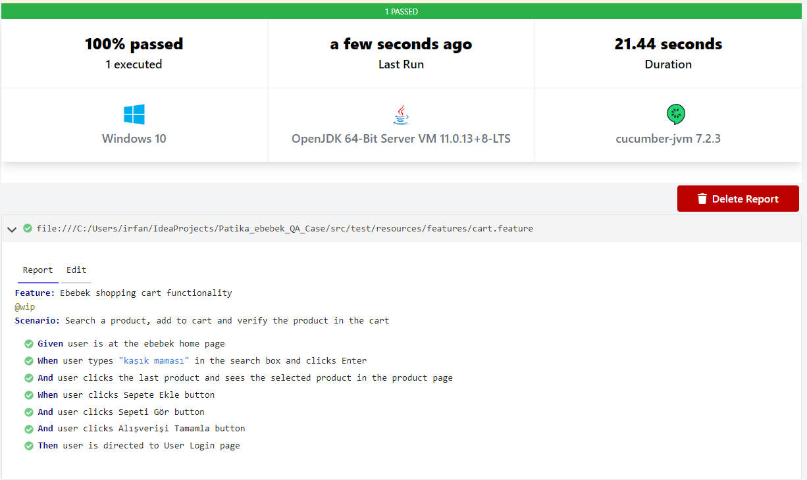

# Task 
Patika ebebek QA Case

## Task Description
Selenium Webdriver ile aşağıdaki maddelerin gerçekleştirilmesi gerekmektedir.

* https://www.e-bebek.com/ sitesi açılır.
* Arama çubuğuna "kaşık maması" yazılır ve arama sonucunda gelen sonuçlardan en son ürün açılır, açılan ürünle arama sonucunda tıklanan ürünün aynı olduğu doğrulanır.
* Ürün sepete eklenir.
* Sağdan açılan modadan sepeti gör butonuna tıklanır.
* Alışverişi tamamla butonuna tıklanır.
* Üye girişi ekranının açıldığı doğrulanır.

## How to run the app?
CukesRunner sınıfında, veya "Maven -> Lifecycle -> Test" ile çalıştırılabilir.

## Test Report

## About the project
* Java OOP ve inheritance prensipleri uygulandı.
* Cucumber BDD ve Gherkin dili kullanıldı.
* Page Object Model (POM) uygulandı.
* Test case'ler cart.feature dosyasında Gherkin dili ile tanımlandı.
* Cucumber framework içerisinde ConfigurationReader, Driver, Hooks kullanıldı.
* Maven build tool kullanıldı, pom.xml'de plugin ve dependency'ler tanımlandı.

## Notes
ebebek Java & QA & SAP Spartacus Practicum.

## Author
İrfan ALKAN
